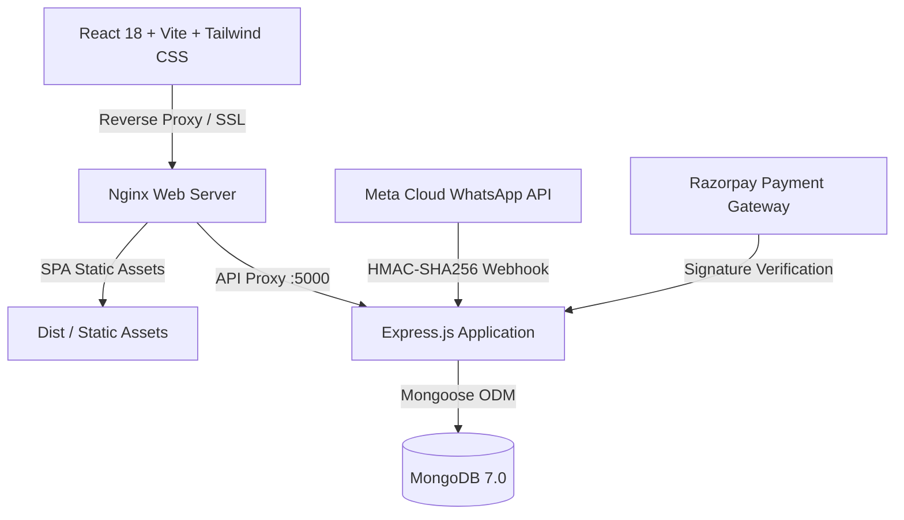

# Glassofy - Architectural Glass Hardware & Fittings Platform

> **Next-generation B2B & D2C Architectural Hardware Platform** designed for fabricators, glass contractors, architects, and luxury interior projects. Engineered for high performance, enterprise discounting, WhatsApp catalog ingestion, and production-grade reliability.

---

## Table of Contents

- [Overview](#overview)
- [Architecture & Tech Stack](#architecture--tech-stack)
- [Project Structure](#project-structure)
- [Key Features](#key-features)
  - [1. Storefront Experience](#1-storefront-experience)
  - [2. Pure Discount & Pricing Engine](#2-pure-discount--pricing-engine)
  - [3. Admin Control Center](#3-admin-control-center)
  - [4. WhatsApp Catalog Ingestion](#4-whatsapp-catalog-ingestion)
  - [5. SEO & Performance Engineering](#5-seo--performance-engineering)
  - [6. Security & Hardening](#6-security--hardening)
- [Getting Started](#getting-started)
  - [Prerequisites](#prerequisites)
  - [Environment Setup](#environment-setup)
  - [Database Seeding](#database-seeding)
  - [Running Locally](#running-locally)
  - [Running with Docker Compose](#running-with-docker-compose)
- [Complete REST API Reference](#complete-rest-api-reference)
- [Automated Testing](#automated-testing)
- [Production Deployment](#production-deployment)
  - [Docker Production Stack](#docker-production-stack)
  - [Nginx & Let's Encrypt SSL](#nginx--lets-encrypt-ssl)
  - [MongoDB Backup & Restore](#mongodb-backup--restore)
- [License](#license)

---

## Overview

**Glassofy** is an industrial-grade e-commerce application tailored specifically for architectural glass hardware: shower hinges, spider fittings, canopy brackets, patch fittings, glass connectors, railing balustrades, and sliding glass systems.

The platform provides a high-converting **dark-mode luxury aesthetic** (`#0F1115` ink canvas, charcoal card surfaces, warm brass and amber accents) matching the industrial precision of solid brass and 304/316 stainless steel architectural products.

---

## Architecture & Tech Stack



### Backend (`/server`)
- **Runtime:** Node.js (v18+) & Express 4.x
- **Database:** MongoDB 7.0 with Mongoose ODM (strict indexing, text indexes, schema validation)
- **Authentication:** JWT stored in secure `httpOnly` cookies with `USER` and `ADMIN` role-based access control
- **Validation:** Zod schema validation middleware for all incoming payloads
- **Security:** Helmet CSP headers, Express Rate Limiting, Mongo Sanitize, HPP (HTTP Parameter Pollution prevention)
- **Document Generation:** PDFKit for dynamic, GST-compliant tax invoices
- **Testing:** Jest + Supertest (unit, integration, and full commercial lifecycle E2E tests)

### Frontend (`/client`)
- **Core:** React 18 + Vite
- **Styling:** Tailwind CSS v3 with custom brass/charcoal dark-mode design system
- **Routing:** React Router v6 with `React.lazy()` and `<Suspense>` route splitting
- **Icons:** Lucide React
- **HTTP Client:** Axios with automated interceptors and CSRF/Bearer token handling
- **SEO:** Dynamic Meta, Open Graph, Twitter Cards, and schema.org JSON-LD structured data

---

## Project Structure

```text
E-commerce_glassofy/
├── client/                     # Vite + React Frontend Application
│   ├── public/                 # Static assets, logos, favicon
│   ├── src/
│   │   ├── api/                # Axios API service instances
│   │   ├── components/         # Reusable UI components
│   │   │   ├── admin/          # Admin modals, tables, metrics
│   │   │   ├── common/         # SEO, ErrorBoundary, PageLoader, Header, Footer
│   │   │   ├── product/        # ProductCard, VariantSelector, FilterSidebar
│   │   │   └── ...
│   │   ├── context/            # AuthContext, CartContext
│   │   ├── pages/              # Lazy-loaded storefront & admin pages
│   │   │   ├── admin/          # Admin Dashboard, Products, Orders, Users, Discounts, etc.
│   │   │   └── ...             # Home, Catalog, Detail, Cart, Checkout, Auth, 404
│   │   ├── App.jsx             # Route definitions with Suspense
│   │   └── index.css           # Design tokens, scrollbars, utility classes
│   ├── nginx.conf              # Production Nginx reverse-proxy configuration
│   └── vite.config.js          # Vite configuration with chunk splitting
├── server/                     # Express.js Backend API
│   ├── data/                   # Seed fixtures (products.json)
│   ├── scripts/                # Database seeding & administrative scripts
│   ├── src/
│   │   ├── controllers/        # Express route controllers
│   │   ├── middleware/         # Auth, Role, Cache, Upload, Error handling
│   │   ├── models/             # Mongoose database models & indexes
│   │   ├── routes/             # REST endpoint route declarations
│   │   ├── services/           # Discount engine, invoice builder, WhatsApp & email services
│   │   ├── utils/              # JWT, password hashing, API response helpers
│   │   ├── app.js              # Express app configuration & middleware pipeline
│   │   └── index.js            # Server entrypoint & DB connection
│   └── tests/                  # Jest test suites (auth, catalog, cart, discount, whatsapp, e2e)
├── docs/                       # Architectural documentation
│   ├── ENVIRONMENT_VARIABLES.md# Detailed variable guide
│   ├── PRODUCTION_DEPLOYMENT.md# Production checklist & deployment guide
│   └── WHATSAPP_SETUP.md       # Meta Business Cloud API setup instructions
├── scripts/                    # Shell automation scripts
│   ├── backup-mongo.sh         # Automated mongodump backup with rotation
│   └── restore-mongo.sh        # Database restore utility
├── docker-compose.yml          # Local development stack (mongo, server, client, mongo-express)
├── docker-compose.prod.yml     # Production stack (mongo, server, client/nginx)
└── README.md                   # Project documentation
```

---

## Key Features

### 1. Storefront Experience
- **Parametric Filtering:** Filter by Category, Finish (Chrome Plate, Satin Stainless, Matt Black, Rose Gold, Brass Antique), Size, and Price range.
- **Persistent State:** All catalog filters synchronize directly to URL query parameters (`?category=...&finish=...`), ensuring shareable links and full refresh persistence.
- **Interactive Product Detail:** Multi-angle image gallery with hover zoom, live variant matrix updating price, MRP, and stock in real-time.
- **Cart Sync:** Guests store cart items in `localStorage`; logging in automatically merges items into their MongoDB persistent cart on the server.
- **Dual Payment Options:** Supports both Razorpay Test Mode (with server-side HMAC verification) and Cash on Delivery (COD).
- **PDF Tax Invoices:** Customers and admins can instantly stream and print GST-compliant PDF tax invoices with itemized tax amounts.

### 2. Pure Discount & Pricing Engine (`discountEngine.js`)
- **Cart-Total Thresholds:** Percentage or flat discounts activated once cart value reaches defined amounts (e.g., 5% off over ₹10,000; 10% off over ₹25,000).
- **Volume Bulk Tiers:** Per-product quantity breaks (e.g., 10-24 units @ 5% off; 25+ units @ 12% off).
- **Coupon Code Validation:** Supports start/end date expiration, total usage limits, per-user limits, and minimum order values.
- **Configurable Stacking Modes:** Configurable via System Settings as either `"best-of"` (automatically awards the customer the single most advantageous discount) or `"stack"` (cumulatively stacks bulk tiers, cart tiers, and coupons).
- **Strict Server Calculation:** Financial arithmetic is computed exclusively on the server using 2-decimal rounded precision, ensuring clients cannot manipulate totals. Includes 18% GST and rule-based shipping calculation.

### 3. Admin Control Center (`/admin`)
- **Role Guard:** All routes and endpoints guarded by `requireRole('ADMIN')`.
- **Audit Logging:** Automatically writes an audit log record for all creations, modifications, and deletions.
- **Real-Time Analytics:** KPIs for total revenue, order count, registered accounts, low-stock items, and 30-day revenue charts.
- **Product Management:** Searchable, filterable table with bulk actions (Publish, Draft, Delete), variant builder, image uploader with preview, and CSV bulk import/export with preview and error reporting.
- **Order Lifecycle Workflow:** Status transitions (`PENDING` -> `CONFIRMED` -> `PACKED` -> `SHIPPED` -> `DELIVERED` or `CANCELLED`), tracking number input, internal administrative notes, and stock restoration on cancellation.
- **Customer Control:** Customer profiles, order histories, cart snapshots, role assignments, and account blocking/unblocking.
- **Discount & Coupon Manager:** Visual dashboard to create, toggle, and expire coupons and discount rules.

### 4. WhatsApp Catalog Ingestion
- **Meta Cloud API Webhook:** Verified handshake (`GET /api/whatsapp/webhook`) and HMAC-SHA256 signature verification (`POST /api/whatsapp/webhook`) using the raw request body.
- **Authorized Whitelist:** Only phone numbers registered in `WhatsappWhitelist` are permitted to ingest products.
- **Tolerant Caption Parser:** Ingests media attachments and extracts specifications formatted as:
  ```text
  Name | Code | Category | Finish | Price | Stock | Description
  ```
  *(Tolerates extra whitespace, optional fields, and capitalization variations).*
- **Automated Draft Creation:** Downloads media to persistent storage, validates input with Zod, creates a `DRAFT` product linked to a `WhatsappMessage` record, and dispatches automated WhatsApp and email acknowledgments.
- **One-Click Publishing:** Admin reviews the draft in the Admin Panel and clicks **Publish**, immediately invalidating the cache and making the product live on the storefront.
- **Local Testing Simulation:** Includes a built-in testing endpoint (`POST /api/whatsapp/simulate`) for end-to-end testing without external Meta credentials.

### 5. SEO & Performance Engineering
- **Search Engine Optimization:** Dynamic page titles, meta descriptions, Open Graph cards, Twitter metadata, and structured data (`schema.org/Product`, `CollectionPage`, `Organization`, `WebSite`).
- **Dynamic XML Sitemap & Robots:** `/sitemap.xml` dynamically indexes all published categories and active products; `/robots.txt` guides search engine crawlers while protecting `/admin` and private routes.
- **Lazy Loading & Route Splitting:** All application pages load on-demand via `React.lazy()` with luxury branded `<PageLoader />` fallbacks, keeping initial bundle size minimal (~15 kB per chunk).
- **Catalogue In-Memory Caching:** High-traffic endpoints (`/api/categories`, `/api/products`, `/api/products/featured`) are cached in memory for rapid sub-5ms responses. Any catalog mutation by admins or WhatsApp triggers automatic, immediate cache invalidation (`invalidateCatalogCache()`).
- **Asset Optimization:** Static images served with 7-day immutable caching headers and lazy decoding.

### 6. Security & Hardening
- **Authentication:** Dual JWT tokens (Access and Refresh) stored in `httpOnly`, `sameSite`, and `secure` cookies.
- **Content Security Policy (CSP):** Strict Helmet CSP directives configured for API endpoints, fonts, and Razorpay checkout scripts.
- **File Upload Protection:** Admin upload endpoint strictly limits files to 5MB and validates MIME types (`image/jpeg`, `image/png`, `image/webp`) with randomized filesystem names.
- **Sanitization & Rate Limiting:** All inputs sanitized against NoSQL injection; sensitive endpoints protected by tiered IP rate limiters.
- **Secret Hygiene:** Zero hardcoded production secrets in repository. `.env*` aggressively ignored while `.env.example` provides complete documentation.

---

## Getting Started

### Prerequisites
- [Node.js](https://nodejs.org/) (v18.0.0 or higher)
- [MongoDB](https://www.mongodb.com/) (v6.0 or higher) or Docker
- [Git](https://git-scm.com/)

---

### Environment Setup

1. Clone the repository:
   ```bash
   git clone https://github.com/your-org/e-commerce-glassofy.git
   cd e-commerce-glassofy
   ```

2. Copy the sample environment configurations:
   ```bash
   cp server/.env.example server/.env
   cp client/.env.example client/.env
   ```

3. Review [docs/ENVIRONMENT_VARIABLES.md](file:///c:/Users/HP/OneDrive/Desktop/technofy%20office%20work/E-commerce_glassofy/docs/ENVIRONMENT_VARIABLES.md) to customize variables for your local setup.

---

### Database Seeding

Populate the database with sample architectural hardware categories, products with multi-finish variants, active coupons, discount rules, default system settings, and demo users:

```bash
# From the root directory:
npm run seed --prefix server
```

**Default Seeded Credentials:**
- **Administrator:** `admin@glassofy.com` / `Admin@123456`
- **Customer:** `customer@example.com` / `Customer@123456`

---

### Running Locally

To run the backend and frontend concurrently in development mode:

1. Install dependencies:
   ```bash
   npm install
   npm run install:all
   ```

2. Start the development servers:
   ```bash
   # Terminal 1: Backend API (port 5000)
   npm run dev --prefix server

   # Terminal 2: Vite Frontend (port 5173 / proxy port 3000)
   npm run dev --prefix client
   ```

3. Open your browser and navigate to:
   - Storefront: `http://localhost:5173`
   - Admin Panel: `http://localhost:5173/admin`
   - API Health Check: `http://localhost:5000/api/health`

---

### Running with Docker Compose

To start the full development environment with MongoDB and Mongo Express GUI:

```bash
docker compose up --build
```

- **Frontend Client:** `http://localhost:3000`
- **Backend API:** `http://localhost:5000`
- **Mongo Express GUI:** `http://localhost:8081` (default login: `admin` / `pass`)

---

## Complete REST API Reference

### Authentication (`/api/auth`)
| Method | Endpoint | Access | Description |
| :--- | :--- | :--- | :--- |
| `POST` | `/api/auth/register` | Public | Register new user account with address and GST |
| `POST` | `/api/auth/login` | Public | Authenticate user, set JWT httpOnly cookie |
| `POST` | `/api/auth/logout` | Authenticated | Invalidate session and clear auth cookies |
| `GET` | `/api/auth/me` | Authenticated | Retrieve current user profile and session data |
| `PUT` | `/api/auth/profile` | Authenticated | Update user name, phone, address, and GST number |
| `POST` | `/api/auth/forgot-password`| Public | Initiate password reset email |
| `POST` | `/api/auth/reset-password` | Public | Reset password using verified token |

### Catalog & Products (`/api/products`, `/api/categories`)
| Method | Endpoint | Access | Description |
| :--- | :--- | :--- | :--- |
| `GET` | `/api/categories` | Public | List all active categories (Cached) |
| `GET` | `/api/products` | Public | Query published products (search, filters, pagination, sort) (Cached) |
| `GET` | `/api/products/featured`| Public | List featured products for homepage carousel (Cached) |
| `GET` | `/api/products/:slug` | Public | Retrieve detailed product specification with active variants |

### Cart & Pricing (`/api/cart`)
| Method | Endpoint | Access | Description |
| :--- | :--- | :--- | :--- |
| `GET` | `/api/cart` | Authenticated | Retrieve user cart with live server-side pricing breakdown |
| `POST` | `/api/cart/items` | Authenticated | Add product variant to cart and validate stock |
| `PUT` | `/api/cart/items/:id` | Authenticated | Update quantity of cart line item |
| `DELETE`| `/api/cart/items/:id` | Authenticated | Remove line item from cart |
| `DELETE`| `/api/cart` | Authenticated | Clear all items from cart |
| `POST` | `/api/cart/merge` | Authenticated | Merge guest localStorage cart items into account cart |
| `POST` | `/api/cart/coupon` | Authenticated | Apply coupon code and recalculate totals |
| `DELETE`| `/api/cart/coupon` | Authenticated | Remove applied coupon from cart |

### Orders & Checkout (`/api/orders`)
| Method | Endpoint | Access | Description |
| :--- | :--- | :--- | :--- |
| `POST` | `/api/orders/checkout` | Authenticated | Create order (COD or Razorpay initialization), reserve stock |
| `POST` | `/api/orders/verify` | Authenticated | Verify Razorpay payment signature and confirm order |
| `GET` | `/api/orders` | Authenticated | List order history for current authenticated user |
| `GET` | `/api/orders/:id` | Authenticated | Retrieve detailed order timeline and billing data |
| `PUT` | `/api/orders/:id/cancel`| Authenticated | Cancel order (if unfulfilled) and restore inventory |
| `GET` | `/api/orders/:id/invoice`| Authenticated | Stream GST-compliant PDF tax invoice |

### Admin Control Center (`/api/admin`)
| Method | Endpoint | Access | Description |
| :--- | :--- | :--- | :--- |
| `GET` | `/api/admin/dashboard` | Admin | Revenue KPIs, recent orders, top products, low stock alerts |
| `GET` | `/api/admin/products` | Admin | List all products (includes DRAFTS) with filters |
| `POST` | `/api/admin/products` | Admin | Create product with variants, bulk pricing, and specifications |
| `PUT` | `/api/admin/products/:id`| Admin | Update product details, inventory, and status |
| `DELETE`| `/api/admin/products/:id`| Admin | Soft or hard delete product |
| `POST` | `/api/admin/products/bulk`| Admin | Perform bulk status changes (PUBLISH, DRAFT, DELETE) |
| `POST` | `/api/admin/products/import-csv`| Admin | Bulk import products from CSV with validation report |
| `GET` | `/api/admin/products/export-csv`| Admin | Export product catalog to CSV format |
| `POST` | `/api/admin/upload-image`| Admin | Upload product media (JPEG, PNG, WebP, max 5MB) |
| `GET` | `/api/admin/orders` | Admin | List all platform orders with customer and status filters |
| `PATCH` | `/api/admin/orders/:id/status`| Admin | Transition order status, add tracking, and append internal note |
| `GET` | `/api/admin/users` | Admin | List and search registered accounts |
| `PATCH` | `/api/admin/users/:id/role`| Admin | Update account role (`USER` or `ADMIN`) |
| `PATCH` | `/api/admin/users/:id/block`| Admin | Block or unblock user access |
| `GET` | `/api/admin/discounts` | Admin | List discount rules and coupons |
| `POST` | `/api/admin/discounts/rules`| Admin | Create new cart total or bulk tier discount rule |
| `POST` | `/api/admin/discounts/coupons`| Admin| Create coupon with usage limits and expiry |
| `GET` | `/api/admin/audit-logs` | Admin | View system audit trail of all administrative actions |
| `GET/PUT`| `/api/admin/settings` | Admin | Read or update application settings (GST, shipping, stacking) |

### WhatsApp Automation (`/api/whatsapp`)
| Method | Endpoint | Access | Description |
| :--- | :--- | :--- | :--- |
| `GET` | `/api/whatsapp/webhook` | Public | Meta verify-token handshake |
| `POST` | `/api/whatsapp/webhook` | Public | Meta webhook receiver with HMAC-SHA256 signature verification |
| `POST` | `/api/whatsapp/simulate`| Public (Dev) | Mock message ingestion for automated testing |
| `POST` | `/api/admin/whatsapp/messages/:id/publish`| Admin | Publish draft product created from WhatsApp message |

### SEO & Health
| Method | Endpoint | Access | Description |
| :--- | :--- | :--- | :--- |
| `GET` | `/sitemap.xml` | Public | Dynamically generated XML sitemap |
| `GET` | `/robots.txt` | Public | Search crawler directives |
| `GET` | `/api/health` | Public | Comprehensive health check (Uptime, MongoDB state, Memory) |

---

## Automated Testing

Glassofy features a comprehensive automated testing suite built with **Jest** and **Supertest**, covering unit logic, integration flows, and complete multi-step commercial lifecycles.

To execute the test suite:

```bash
# Run all server test suites:
npm test --prefix server

# Run individual test suites:
npm test -- tests/auth.test.js --prefix server
npm test -- tests/catalog.test.js --prefix server
npm test -- tests/cart.test.js --prefix server
npm test -- tests/discount.test.js --prefix server
npm test -- tests/admin.test.js --prefix server
npm test -- tests/whatsapp.test.js --prefix server
npm test -- tests/e2e.test.js --prefix server
```

### End-to-End (E2E) Test Flow (`tests/e2e.test.js`)
The E2E test validates the full 7-step commercial lifecycle:
1. **User Registration:** Registers a fabrication client with GST and billing address.
2. **Catalog Browsing:** Queries categories and filters products by architectural finish.
3. **Cart Operations:** Adds product variants and verifies stock availability.
4. **Discount Engine:** Applies coupon `WELCOME10`, asserts 18% GST and rule-based shipping calculations.
5. **Checkout:** Places Cash on Delivery order, confirms stock decrement, and validates cart clearing.
6. **Admin Fulfillment:** Admin updates order status through `PACKED` -> `SHIPPED` (with tracking number) -> `DELIVERED`.
7. **WhatsApp Ingestion & Live Storefront:** Ingests product image and formatted caption via mock webhook, verifies draft creation, publishes via admin endpoint, and confirms immediate appearance in public search.

---

## Production Deployment

### Docker Production Stack
A dedicated production compose configuration (`docker-compose.prod.yml`) runs containerized instances of MongoDB, the Node.js API server, and a high-performance Nginx web server.

To build and run in production mode:

```bash
docker compose -f docker-compose.prod.yml up --build -d
```

### Nginx & Let's Encrypt SSL
Production Nginx (`client/nginx.conf`) is configured for:
- Automatic Gzip compression for JS, CSS, and JSON
- Immutable 1-year browser caching headers for static assets (`/assets/`)
- Let's Encrypt HTTP challenge path (`/.well-known/acme-challenge/`)
- API reverse proxying to `http://server:5000` with WebSocket support
- SPA fallback routing to `index.html`

For step-by-step SSL certificates setup via Certbot, see [docs/PRODUCTION_DEPLOYMENT.md](file:///c:/Users/HP/OneDrive/Desktop/technofy%20office%20work/E-commerce_glassofy/docs/PRODUCTION_DEPLOYMENT.md).

---

### MongoDB Backup & Restore

Automated backup scripts with gzip compression and 14-day rotation are located in `/scripts`:

```bash
# Execute manual or cron backup:
./scripts/backup-mongo.sh

# Restore from a backup archive:
./scripts/restore-mongo.sh /backups/mongo/glassofy_backup_2026-10-05_120000.tar.gz
```

---

## License

Glassofy Architectural Hardware Platform is proprietary software. All rights reserved.
